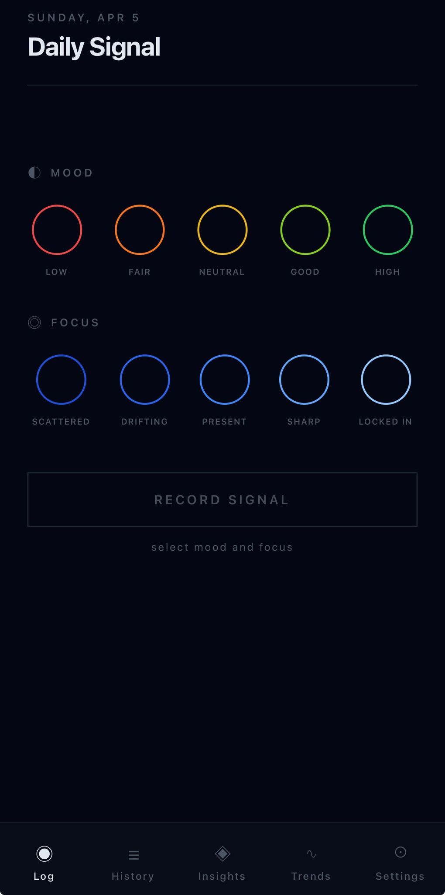
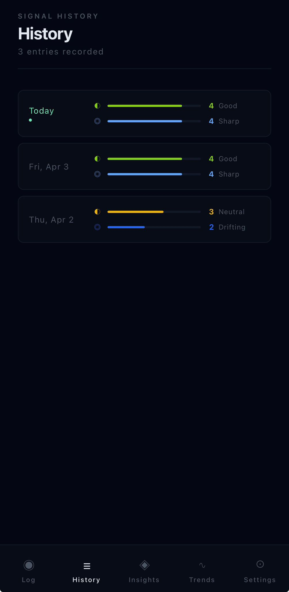
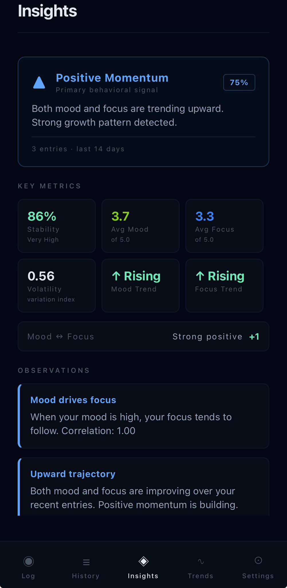
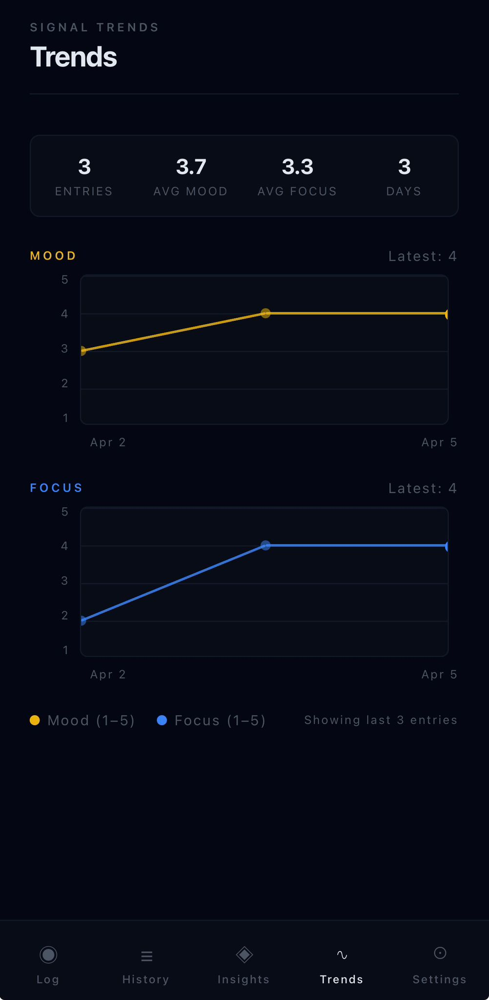
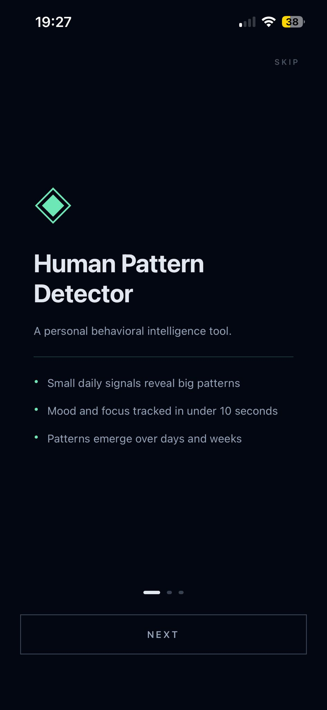
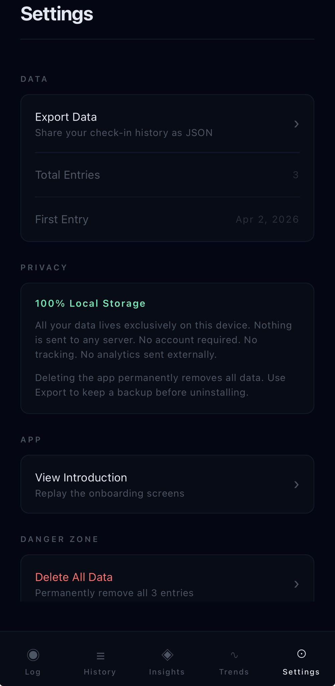

# Human Pattern Detector

<div align="center">


### Small daily signals → meaningful behavioral patterns.

A personal behavioral intelligence tool built with React Native + TypeScript.
Log your mood and focus in under 10 seconds. Watch your patterns emerge.

[](https://reactnative.dev/)
[](https://expo.dev/)
[](https://www.typescriptlang.org/)
[](https://expo.dev/)

</div>

---

## App Preview

<div align="center">
<table>
  <tr>
    <td align="center" width="33%">
      
      <br/><sub><b>Daily Log</b></sub>
      <br/><sub>Mood + focus in under 10 seconds</sub>
    </td>
    <td align="center" width="33%">
      
      <br/><sub><b>Signal History</b></sub>
      <br/><sub>Visual timeline of all entries</sub>
    </td>
    <td align="center" width="33%">
      
      <br/><sub><b>Pattern Engine</b></sub>
      <br/><sub>Live behavioral signal detection</sub>
    </td>
  </tr>
  <tr>
    <td align="center" width="33%">
      
      <br/><sub><b>Trend Charts</b></sub>
      <br/><sub>Custom-built line visualization</sub>
    </td>
    <td align="center" width="33%">
      
      <br/><sub><b>Onboarding</b></sub>
      <br/><sub>Philosophy-first introduction</sub>
    </td>
    <td align="center" width="33%">
      
      <br/><sub><b>Settings</b></sub>
      <br/><sub>Data export + privacy controls</sub>
    </td>
  </tr>
</table>
</div>

---

## What It Does

HPD collects two data points per day — **mood** and **focus** — and runs them
through a statistical engine that detects behavioral patterns invisible to
the naked eye.

```
Daily Input (< 10 seconds)
  mood: 1–5   focus: 1–5
        ↓
  Pattern Detection Engine
  ├── Variance analysis      → Volatility Index
  ├── Stability scoring      → 0–100 score
  ├── Trend detection        → Rising / Falling / Flat
  ├── Pearson correlation    → Mood ↔ Focus relationship
  └── Signal classification  → STABLE / VOLATILE / MOMENTUM
                               DECLINING / CONSISTENT
        ↓
  Human-readable Insights
```

---

## Features

### ◉ Daily Check-In
- Animated dot selector for mood and focus (1–5 scale)
- Semantic color coding — warm scale for mood, blue scale for focus
- One entry per day enforcement
- Logged confirmation with today's values displayed

### ≡ Signal History
- Reverse-chronological entry list with visual progress bars
- Relative date labels (Today, Yesterday, date)
- FlatList virtualization — performant at any data size

### ◈ Pattern Insights
- Primary behavioral signal with confidence percentage
- 6-metric analytics grid (stability, averages, volatility, trends)
- Dynamically generated observation cards
- Cold-start state with progress indicator (needs 3+ entries)

### ∿ Trend Visualization
- Custom line charts built without any external chart library
- Mood and focus trends over last 30 entries
- Summary stats panel

### Onboarding
- 3-page swipeable introduction
- Sets cold-start expectations honestly
- Skip option — zero friction

### Settings
- Full data export as JSON via system share sheet
- Two-step confirmed data reset
- Privacy statement built in

---

## Architecture

```
HumanPatternDetector/
│
├── app/                          # Expo Router (file-based routing)
│   ├── (tabs)/
│   │   ├── index.tsx             # Check-in screen
│   │   ├── history.tsx           # History screen
│   │   ├── insights.tsx          # Insights screen
│   │   ├── trends.tsx            # Trends screen
│   │   └── settings.tsx          # Settings screen
│   ├── onboarding.tsx            # First-launch flow
│   └── _layout.tsx               # Root navigation
│
└── src/
    ├── domain/
    │   └── CheckIn.ts            # Core data model + factory
    ├── storage/
    │   └── checkinStorage.ts     # AsyncStorage abstraction
    ├── analytics/
    │   ├── signals.ts            # Pattern detection engine
    │   └── insights.ts           # Insight text generation
    ├── components/
    │   ├── MoodSelector.tsx      # Animated mood input
    │   └── FocusSelector.tsx     # Animated focus input
    ├── hooks/
    │   ├── useCheckins.ts        # Data access hook
    │   └── useAnalytics.ts       # Analytics bridge hook
    └── theme/
        ├── colors.ts             # Design system colors
        ├── typography.ts         # Type scale
        └── index.ts              # Barrel export
```

### Key Principles

| Principle | Implementation |
|-----------|----------------|
| Local-first | AsyncStorage — no server, no account required |
| Separation of concerns | UI / Domain / Analytics / Storage strictly separated |
| Pure analytics | Engine functions have zero side effects |
| Type safety | TypeScript strict mode throughout |
| Performance | FlatList virtualization, useMemo on analytics |

---

## Tech Stack

| Layer | Technology | Reason |
|-------|------------|--------|
| Framework | React Native + Expo SDK 54 | Cross-platform, fast iteration |
| Language | TypeScript strict mode | Data precision, full safety |
| Navigation | Expo Router (file-based) | Clean structure, no boilerplate |
| Storage | AsyncStorage | Local-first, zero config |
| Animations | RN Animated API | Native thread, smooth 60fps |
| Charts | Custom-built | Zero dependency, full control |
| Build | EAS Build | Cloud iOS builds on Windows |

---

## Analytics Engine

The pattern detection engine in `src/analytics/signals.ts` uses real statistical methods:

**Variance** — how spread out scores are day to day:
```
[3, 3, 4, 3]  →  low variance   →  Stable
[1, 5, 1, 5]  →  high variance  →  Volatile
```

**Stability Score** — normalized to 0–100:
```
stabilityScore = (1 - combinedVariance / maxVariance) × 100
```

**Pearson Correlation** — mood ↔ focus relationship:
```
+1.0  →  mood and focus always move together
 0.0  →  no relationship
-1.0  →  mood and focus move opposite
```

**Trend Detection** — first half vs second half average:
```
delta > +0.4  →  Rising
delta < -0.4  →  Falling
otherwise     →  Flat
```

---

## Getting Started

### Prerequisites
- Node.js 18+
- Expo Go app (iOS or Android)

### Run Locally

```bash
git clone https://github.com/Ruyaguloglu/HumanPatternDetector.git
cd HumanPatternDetector
npm install
npx expo start
```

Scan the QR code with Expo Go. Done.

---

## Roadmap

### v1.1 — Habit Formation
- [ ] Daily push notification reminder
- [ ] Streak counter on Log screen
- [ ] Custom reminder time in Settings

### v1.2 — Intelligence
- [ ] Weekly summary notification
- [ ] Burnout pattern detection
- [ ] Recovery cycle recognition

### v1.3 — Polish
- [ ] Light / dark mode toggle
- [ ] Submission micro-animation
- [ ] Enhanced empty states

### v2.0 — Scale
- [ ] SQLite migration for performance
- [ ] Optional encrypted cloud backup
- [ ] CSV export
- [ ] ML-assisted pattern classification

---

## Privacy

> All data lives exclusively on your device.

- No account required
- No server communication — zero network requests
- No third-party tracking or analytics SDKs
- No advertisements
- Full data ownership — export or delete anytime

---

## Development Phases

| Phase | Deliverable | Status |
|-------|-------------|--------|
| 0 | Foundation, design system, navigation | ✅ Complete |
| 1 | Data model, storage layer, custom hooks | ✅ Complete |
| 2 | Check-in screen + animated selectors | ✅ Complete |
| 3 | History screen with FlatList | ✅ Complete |
| 4 | Analytics engine (variance, correlation, trends) | ✅ Complete |
| 5 | Insights screen — engine output | ✅ Complete |
| 6 | Trends screen — custom charts | ✅ Complete |
| 7 | Onboarding — first-launch flow | ✅ Complete |
| 8 | Settings, export, production config | ✅ Complete |

---

## Author

**RÜYA GULOĞLU**
Mobile developer focused on behavioral data and minimal product design.

[GitHub] https://github.com/Ruyaguloglu · [LinkedIn] https://www.linkedin.com/in/r%C3%BCya-g%C3%BClo%C4%9Flu-950b3b234

---

<div align="center">

*"Small data points → meaningful behavioral insights."*

**Human Pattern Detector** — Built from scratch. Shipped with intention.

</div>